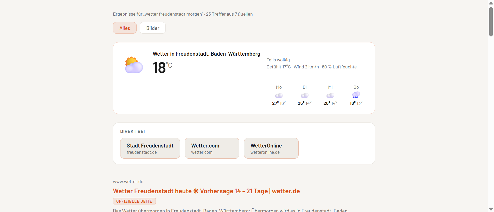
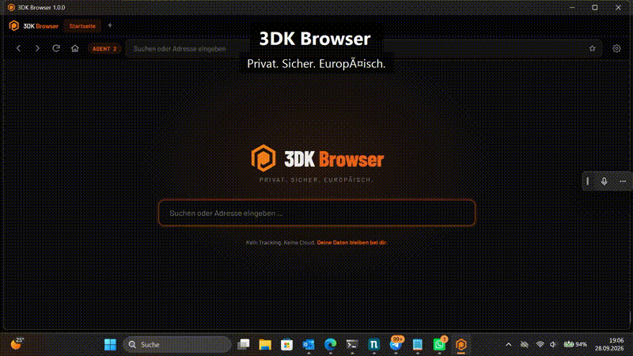

# 3DK Browser

<p align="center">
  
</p>

**Ein datenschutzfreundlicher Browser auf Chromium-Basis — ohne Tracking durch uns, ohne Pflicht-Account, ohne Betreiber-Server.** Verlauf, Downloads, Einstellungen und Favoriten liegen verschlüsselt auf deinem Gerät. Open Source (AGPL-3.0), nicht-kommerziell.

<p align="center">
  <a href="docs/3dk-browser-demo.mp4"></a>
</p>
<p align="center"><i>Kurze Demo (Video anklicken) — Suche mit „Direkt bei“, Auszügen und KI-Agent-Anbindung.</i></p>

## Download — Version 1.0.3

| System | Datei |
|---|---|
| **Windows** (Installer) | `3DK-Browser-1.0.3-setup.exe` — siehe [Releases](https://github.com/3dk-project-fds/3DK-Browser/releases/tag/v1.0.3) |
| **Linux** (AppImage, ungeprüft) | `3DK.Browser-1.0.3.AppImage` — [Releases](https://github.com/3dk-project-fds/3DK-Browser/releases/tag/v1.0.3) |
| **Linux** (deb, ungeprüft) | `3dk-browser_1.0.3_amd64.deb` — [Releases](https://github.com/3dk-project-fds/3DK-Browser/releases/tag/v1.0.3) |

SHA-256-Prüfsummen: [CHECKSUMMEN.txt im Release](https://github.com/3dk-project-fds/3DK-Browser/releases/tag/v1.0.3).
Hinweis: Der Installer ist **nicht signiert** — Windows zeigt deshalb beim ersten Start „Windows hat deinen PC geschützt“. Dann **„Weitere Informationen“ → „Trotzdem ausführen“** (Erklärung: [docs/code-signing.md](docs/code-signing.md)).

> Stand 1.0.3: lauffähig unter Windows (getestet) und Linux (Pakete ungeprüft).
> Geprüft und dokumentiert in [docs/abnahme.md](docs/abnahme.md).
> Enthalten: Suche auf eigenem Weg („Direkt bei“-Kacheln, Auszüge aus den
> Seiten, Wetter-Kachel), Favoriten, Assistenten-Anbindung (MCP), Cloud-Sicherung
> (verschlüsselt), Adblock-Schalter, Impressum und Datenschutzerklärung im Browser.

## Was der Browser hält — und was nicht

| Versprechen | Umsetzung |
|---|---|
| **Kein Betreiber-Server nötig** | Die Suche läuft über mehrere freie Quellen parallel (Bing, Brave, Mojeek, DuckDuckGo, Wikipedia, anonyme öffentliche SearXNG-Instanzen); keine Anmeldung, kein Konto. Eine eigene SearXNG-Instanz ist *optional* eintragbar. |
| **Kein Tracking durch uns** | Im Code steckt keine Telemetrie, kein Absturzversand, kein Zähler. Nachgemessen mit [tools/sicherheitsprobe.js](tools/sicherheitsprobe.js). |
| **Trackingschutz für Seiten** | Eine kuratierte Liste (104 Analyse- und Fingerprinting-Dienste) wird über das Netzwerk blockiert. |
| **Adblock, abschaltbar** | Werbe-Hosts aus [StevenBlack/hosts](https://github.com/StevenBlack/hosts) (MIT, 74.758 Domains) werden standardmäßig blockiert; Abschalter in den Einstellungen unter Datenschutz. Bewusst als Host-Filter — skalierbar ohne Seiten zu brechen. |
| **Drittanbieter-Cookies aus** | Chromium-Schalter gegen Drittanbieter-Cookies plus zweite Schicht im Browser-Stack. |
| **Referrer bescheiden** | Seiten sehen nur die Herkunfts-Domain, nicht die genaue Adresse. DNT und Global Privacy Control werden mitgesandt (ehrlich: wenig wirksam, abschaltbar). |
| **Berechtigungen nur mit Zustimmung** | Kamera, Mikrofon, Standort und Benachrichtigungen werden abgewiesen, wenn der Nutzer nicht ausdrücklich zustimmt. Vollbild und Zeigersperre bleiben erlaubt. |
| **Lokale Nutzerdaten verschlüsselt** | Verlauf, Downloads und Einstellungen liegen als AES-256-GCM-Dateien im Profil; der Daten-Key ist an den Betriebssystem-Tresor des Nutzerkontos versiegelt. |
| **Webseiten haben keine Browser-Rechte** | Die Brücke zu Verlauf, Einstellungen und Cloud existiert nur in den eigenen Seiten. Jeder einzelne Aufruf prüft im Hauptprozess die Herkunft. |
| **Ehrliche Grenze** | Adblock stoppt bekannte Werbenetzwerke, nicht jede einzelne Anzeige; die Suchqualität bleibt die der freien Quellen — ganz ohne Tracking-Ökosystem geht es nicht. |

## Suche

Mehrere Quellen laufen gleichzeitig, die erste Antwort erscheint, bevor die
langsamen fertig sind (progressive Ergebnisliste). Das Neureihen passiert auf
dem Gerät: Marken-Boost (offizielle Seite zuerst), Konsens über unabhängige
Indexfamilien, Dubletten je Domain. Ortsbezogene Anfragen („wetter
freudenstadt“, „wetter morgen“) bekommen eine Wetter-Kachel auf der
Startseite.

Vorab-Suche beim Tippen und Enter teilen sich dieselbe Anfrage; Doppelanfragen
gehen nicht mehr raus. Wiederholte Antworten kommen aus dem Zwischenspeicher,
Verbindungen zu den Quellen werden beim Start vorgewärmt.

## Plattformen

| Plattform | Status |
|---|---|
| Windows (Chromium über Electron) | v1, Installer (NSIS) |
| Linux (Chromium über Electron) | v1, `.deb`/`.AppImage` |
| iOS/Android (WebKit) | offen, Adapter geplant |

## Technik

Chromium-Engine über Electron, eingebettet — nichts wird vom System geladen,
keine Microsoft-Webviews. Jeder Tab ist ein eigener Renderer
(`WebContentsView`), die Chrome-Leiste und alle eigenen Seiten sind
3dk-Oberfläche (Dark `#0D0D0D`, Akzent `#E8621A`, Barlow, Schriften gebündelt,
keine externen Aufrufe beim Start).

```
app/
  main.js         Hauptprozess: IPC mit Herkunftsprüfung, Fenster, Härtung
  shell.js        ein Fenster mit seinen Tabs (mehrere Fenster = ein Prozess)
  security.js     Vertrauensgrenze eigene Seite / fremde Webseite
  store.js        verschlüsseltes Profil (AES-256-GCM, Schlüssel im OS-Tresor)
  search.js       parallele Metasuche, progressives Neureihen
  history.js      Verlauf und Downloads (gekürzt, geprüft, verschlüsselt)
  cloud.js        WebDAV-Backup, clientseitig mit scrypt + AES-256-GCM
  blocklist.js    kuratierte Tracking-Domains + Adblock-Hosts (StevenBlack, MIT)
  agent-api.js    Assistenten-Dienst (MCP über HTTP, Schlüssel, Sperren)
  agent-tools.js  die zwei Werkzeuge, mit eigenem leerem Agent-Profil
  chrome/         Leiste, Startseite, Ergebnisliste, Verlauf, Einstellungen
tools/
  sicherheitsprobe.js   26 Prüfpunkte gegen fremde Webseiten
  cloud-test.js         Runden durch das Backup inkl. Abwehrfälle
  search-benchmark.js   Laufzeiten und Trefferzahlen der Suche
  agent-api-test.js     24 Prüfpunkte für die Assistenten-Anbindung
  mcp-bridge.js         Brücke für Clients, die nur stdin/stdout sprechen
```

## Bauen und Prüfen

```bash
npm install
npm start           # Entwicklung
npm run probe       # Sicherheitstest (öffnet einen lokalen Angreifer-Server)
npm run cloudtest   # Backup-Runden inkl. falscher Passphrase
npm run bench       # Suchgeschwindigkeit messen
npm run agenttest   # Prüfsuite Assistenten-Anbindung (24 Punkte)
npm run build       # Installer nach dist/
```

## Installer, SmartScreen und Prüfsummen

Der Installer ist **unsigniert**, weil ein vertrauenswürdiges Code-Signing-
Zertifikat Geld und Identitätsprüfung kostet (ehrliche Aufstellung in
[docs/code-signing.md](docs/code-signing.md)). Windows zeigt deshalb beim
ersten Start „Windows hat deinen PC geschützt“. So geht es weiter:
**„Mehr Informationen“ → „Trotzdem ausführen“**. Das ist keine Schwäche des
Browsers, sondern eine Folge des fehlenden Zertifikats.

Damit niemand eine manipulierte Datei untergeschoben bekommt, liegt je Release
eine `CHECKSUMMEN.txt` mit SHA-256 über jedem Paket. Eigene Datei
dagegenprüfen:

```bash
certutil -hashfile "3DK-Browser-1.0.3-setup.exe" SHA256
```

## Assistenten als Werkzeugnutzer

Der Browser kann einem KI-Agenten auf demselben Rechner zwei Werkzeuge geben:
`search3dk` (suchen, wie die Ergebnisliste) und `fetchPage` (eine Seite im
echten Chromium lesen, auch eine per JavaScript gebaute). Einschalten unter
Einstellungen → „Assistenten-Anbindung (MCP)“, Standard ist **aus**.

Der Agent bekommt ein eigenes leeres Profil — nie deinen Verlauf, deine Cookies
oder angemeldete Konten — und kann den Browser **nicht** bedienen: kein Klick,
keine Eingabe, kein `evaluate`. Der Dienst hängt nur an `127.0.0.1`, verlangt
einen Schlüssel, prüft Host und Herkunft, drosselt auf 30 Aufrufe je Minute und
protokollt die letzten 50 Anfragen in den Einstellungen.

Anleitung samt Client-Snippets: [docs/agenten-anbindung.md](docs/agenten-anbindung.md)

## Einstellungen, die es gibt

Farbschema hell/dunkel · Trackingschutz · Adblock-Schalter · Cookies nur erster
Partei · Referrer · DNT/GPC · Browser-Kennung glätten · eigene Metasuche
(optional) · Verlauf, Downloads und „restlos leeren“ · optionale WebDAV-Sicherung
mit eigener Passphrase (https Pflicht, http nur nach ausdrücklicher Freigabe)

## Lizenz

AGPL-3.0 — siehe [LICENSE](LICENSE). © 2026 Konstantin Pfeifer.

Finanzierung: nicht-kommerziell (Spenden/Förderung). Keine Datenverwertung.
